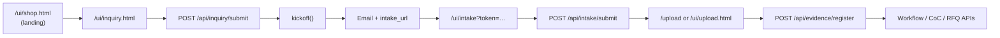

> **DEPRECATED — NOT DEPLOYED — HISTORICAL ONLY**
> Archived under rchive/legacy/stripe/. Do not use for launch decisions.

# KeepYourContracts — Direct Runtime Flow

**Date:** 2026-05-19  
**Topology:** Single FastAPI service (`server.py`) on Render Docker (`kyc-backend`)  
**Commerce:** No Shopify. Stripe Payment Links optional (external). Onboarding is **inquiry-first** or **ops kickoff**.

---

## Runtime topology

```
Customer / Ops
      │
      ▼
┌─────────────────────────────────────┐
│  Render: kyc-backend (Docker)       │
│  uvicorn server:app :10000          │
│  Static: /ui → ui/                  │
│  Health: GET /healthz             │
└─────────────────────────────────────┘
      │
      ├── data/inquiries/     (inquiry JSON)
      ├── data/projects/      (per-project dirs)
      └── data/ledger/        (events)
```

**Canonical URLs (verified on Render):**

| Host | Role |
|------|------|
| `https://jetfighter-compliance.onrender.com` | **Live backend** |
| `https://keepyourcontracts.com` | **Not wired to backend** (Cloudflare placeholder; DNS fix required) |

---

## Customer path (direct)



### 1. Landing

| Item | Value |
|------|--------|
| Path | `/` → 302 → `/ui/shop.html` |
| File | `ui/shop.html` |
| Payment CTAs | External Stripe Payment Links (`buy.stripe.com/…`) — **does not call `kickoff()` automatically** |

### 2. Inquiry

| Item | Value |
|------|--------|
| Page | `GET /ui/inquiry.html` |
| Submit | `POST /api/inquiry/submit` (multipart form: `name`, `email`, `subject`, `message`) |
| Server | Saves `data/inquiries/inquiry-{timestamp}.json`, notifies `DIGEST_EMAIL_TO` if SMTP on |
| Kickoff | `order_id = INQ-{timestamp}`, `skus = [subject]`, then **`kickoff()`** |
| Response | `{ ok, project_id, intake_url }` |

### 3. kickoff()

| Step | Action |
|------|--------|
| 1 | `new_project(order_id, email, name, skus)` |
| 2 | `init_workflow`, `set_phase(..., "INTAKE")` |
| 3 | `make_intake_token(project_id, email)` |
| 4 | Email with `{PUBLIC_BASE_URL}/ui/intake?token=…` |
| 5 | Ledger event `EVT-{project_id}-ORDER` |

**Ops alternate entry:** `POST /events/payment/test` with JSON `{ order_id, email, name, skus }` (used by `ui/new_client.html`).

### 4. Intake

| Item | Value |
|------|--------|
| Page | `GET /ui/intake` or `/ui/intake.html?token=…` |
| Script | `/ui/intake.js` (posts form `#f` to API) |
| Submit | `POST /api/intake/submit` (`token` + company/contact fields) |
| Result | Writes `communications/intake.json`, updates checklist |

### 5. Upload

| Item | Value |
|------|--------|
| Routes | `GET /upload`, `GET /ui/upload.html` |
| API | `POST /api/evidence/register` (`project_id`, `media_type`, `owner`, `file`) |
| Gap | Upload HTML form **not yet wired** to API (manual/API upload only) |

### 6. Evidence / compliance workflow

| API | Purpose |
|-----|---------|
| `POST /api/coc/event` | JSON chain-of-custody event |
| `POST /api/coc/event/form` | Form CoC event |
| `POST /api/evidence/register` | File artifact registration |
| `GET /api/project/{id}/status` | Status board |
| `POST /api/project/{id}/advance` | Phase advance |
| RFQ routes | Vendor quotes (retained) |

---

## Deployment-safe operational truth

| Setting | Required |
|---------|----------|
| `PUBLIC_BASE_URL` | Production URL for intake links in email |
| `INTAKE_TOKEN_SECRET` | Token signing (or `JWT_SECRET` if shared) |
| `SMTP_*` + `DIGEST_EMAIL_TO` | Inquiry notify + kickoff email |
| `DATABASE_URL` | If/when DB-backed features enabled |
| `STRIPE_*` | Optional; only if Stripe webhook added later |

**Removed env (safe to delete in dashboard):** `SHOPIFY_WEBHOOK_SECRET`, `SHOPIFY_SECRET`.

**Health check:** `GET /healthz` → `{"ok":true}`

**Do not sync** `render.yaml` to Render without Owner approval (stabilization rule).

---

## Ops / test paths

| Path | Use |
|------|-----|
| `POST /events/payment/test` | Manual project + intake URL (`ui/new_client.html`) |
| `POST /api/test-webhook` | Same kickoff, accepts `order_id`/`id`, `email`, `skus` or `line_items` |
| `GET /ui/control.html` | Admin console |

---

## What was removed (Shopify layer)

- Shopify HMAC webhook
- Shopify adapter module
- Shopify env vars in code/blueprint

No replacement commerce platform was added. Inquiry and ops paths feed **`kickoff()`** directly.
