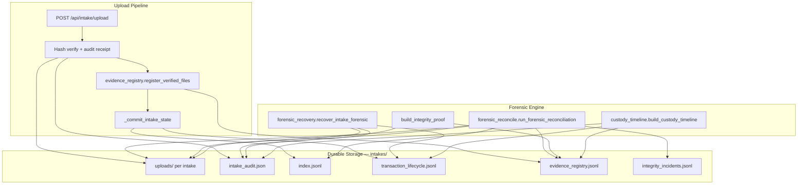
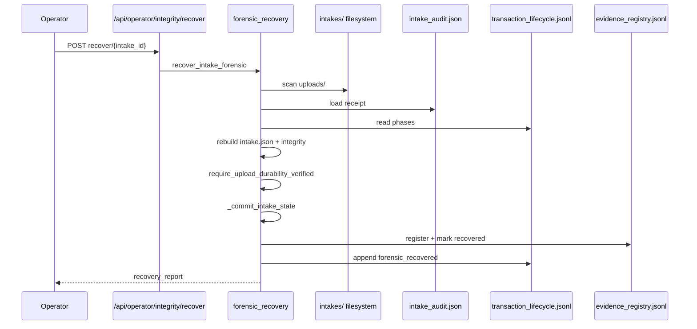

# Forensic Evidence Integrity Engine

Canonical implementation under `services/intake/` — registry, reconciliation, recovery, custody timeline, and fleet-wide proof.

## Architecture

## Recovery flow

## Failure-mode matrix

| Failure | Detection | Severity | Auto-repair | Operator action |
|---------|-----------|----------|-------------|-----------------|
| File on disk, not in registry | `disk_file_not_in_registry` | critical | No | Run reconcile; forensic recover if intake invisible |
| Audit hash ≠ disk hash | `hash_mismatch_corrupt` / `audit_hash_mismatch` | critical | No | Request customer re-upload; do not approve |
| Registry entry, file missing | `registry_file_missing_on_disk` | high | No | SEV-1 investigation |
| Files without audit receipt | `files_without_audit_receipt` | high | No | Forensic recover or re-upload |
| Commit complete, not in index | `committed_not_in_index` | high | No | POST `/api/operator/integrity/recover/{id}` |
| Intake on disk, not in index | `disk_intake_not_in_index` | high | No | Forensic recover |
| Index row, dir missing | `index_intake_missing_on_disk` | critical | No | SEV-1 — data loss suspected |
| Pending intake not in queue | `intake_not_queue_visible` | medium | No | Reload cockpit; reconcile fleet |
| Partial upload | custody `partial_upload` | amber | Startup `recover_uncommitted_intakes` only | Customer re-submit via magic link |
| COTE mismatch | `cote_integrity_mismatch` | medium | No | Reconcile; fix storage truth first |

## Operator API

| Method | Path | Purpose |
|--------|------|---------|
| GET | `/api/operator/integrity/reconcile` | Fleet forensic reconciliation report |
| GET | `/api/operator/integrity/proof` | Fleet counts; `ok: true` only when all problem counts are 0 |
| GET | `/api/operator/integrity/timeline/{intake_id}` | Merged custody timeline |
| POST | `/api/operator/integrity/recover/{intake_id}` | Explicit forensic recovery |

All routes require ops auth (`require_ops_access`).

## Production verification checklist

- [ ] `python -m pytest tests/test_forensic_integrity_engine.py -q` passes
- [ ] `python scripts/prove_forensic_integrity.py` exits 0
- [ ] Upload test file → `evidence_registry.jsonl` gains verified row
- [ ] `GET /api/operator/integrity/proof` returns `ok: true` on clean fleet
- [ ] Cockpit **Evidence Integrity** panel shows green when `proof.ok === true`
- [ ] COTE `upload_pipeline` node red when `proof.ok === false`
- [ ] Startup logs forensic reconciliation after retention scan
- [ ] Corrupting a file on disk makes `proof.ok` false and reconcile reports mismatch
- [ ] `POST /api/operator/integrity/recover/{id}` restores index visibility after index row deletion

## Constraints

- ONE pipeline (`services/intake/intake.py`), ONE tree (`data/intakes/` or `KYC_DATA/intakes/`)
- Registry is append-only; latest row per `evidence_id` wins
- Reconciliation **never** silently auto-repairs — reports + incidents only
- Forensic recovery is explicit (operator POST) except existing startup `recover_uncommitted_intakes`
