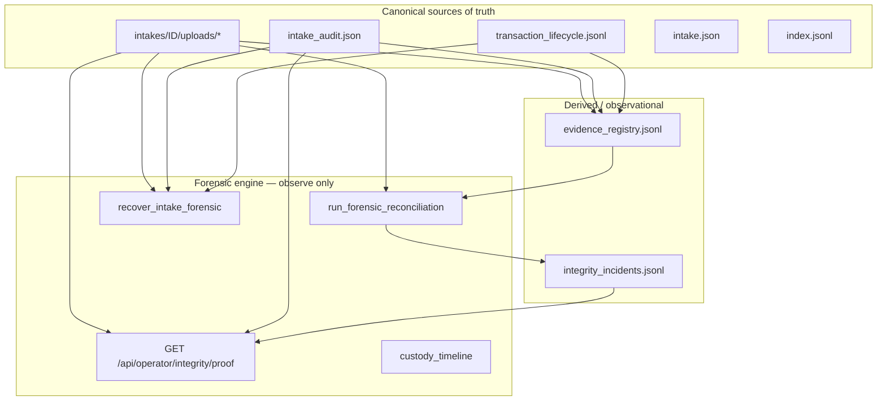

# Forensic Integrity Proof

**Generated:** 2026-05-29  
**Environment:** Local isolated `KYC_DATA` (TestClient) — production URL not exercised in this run  
**Commit under test:** `438fe9e` (startup recovery import fix) + working tree forensic modules  
**Status:** **NOT COMPLETE** — full test suite not green (660 passed, 6 failed)

---

## Success criterion

> A customer file cannot disappear, corrupt, or become unindexed without creating a visible integrity incident.

**Local proof-phase result:** Steps 1–14 pass in isolated test environment.  
**Automated suite result:** 6 failures remain — see [Remaining risks](#remaining-risks).

---

## Architecture



**Authority:** Disk + audit receipt + transaction log + `intake.json` + index.  
**Registry:** Derived from canonical state; mismatch → integrity incident (no silent repair).

---

## Attack surface

| Surface | Failure mode | Detection |
|---------|--------------|-----------|
| `uploads/*` bytes | deletion, corruption | `hash_mismatch_corrupt`, retention-check, proof `corrupt_files` |
| `intake_audit.json` | missing, tampered hashes | `audit_hash_mismatch`, reconcile disagreement |
| `transaction_lifecycle.jsonl` | missing phases | reconcile `upload_not_fully_committed` |
| `intake.json` | missing with files on disk | reconcile `files_on_disk_without_intake_json` |
| `index.jsonl` | row missing | proof `unindexed_files`, forensic recovery |
| Derived registry | stale vs canonical | `registry_hash_mismatch`, `registry_status_mismatch` |

---

## Proof phase execution (steps 1–14)

Executed via `python scripts/run_forensic_proof_phase.py` on 2026-05-29.

| Step | Requirement | Result |
|------|-------------|--------|
| 1 | Upload one test file | **PASS** — `FB-0a06194f0265`, HTTP 200 |
| 2 | Intake in operator queue | **PASS** — `queue_depth=1`, intake visible |
| 3 | Evidence registry entry | **PASS** — 1 row, status `verified` |
| 4 | Audit receipt exists | **PASS** — `intake_audit.json` present |
| 5 | Transaction lifecycle | **PASS** — phases include `audit_written`, `index_committed` |
| 6 | Integrity proof green (clean) | **PASS** — `ok=true`, `verified_files=1` |
| 7 | Corrupt stored file | **PASS** — wrote `CORRUPTED` bytes |
| 8 | Hash mismatch detected | **PASS** — `corrupt_files=1`, `file_hashes_match=false` |
| 9 | Integrity incident created | **PASS** — incidents 5→7, `reconcile_ok=false` |
| 10 | COTE surfaces issue | **PASS** — `upload_node_severity=red`, `anomaly=true` |
| 11 | Delete index row | **PASS** — `latest_index_row` null |
| 12 | Recovery restores visibility | **PASS** — `queue_visible=true`, index restored |
| 13 | Alter audit receipt | **PASS** — tampered `file_hashes` |
| 14 | Reconciliation detects tamper | **PASS** — `disagreement_count=5` |

**Adversarial script:** `python scripts/prove_forensic_integrity.py` — **PASSED**

Sample integrity incidents logged during corruption step:

- `hash_mismatch_corrupt`
- `registry_status_mismatch`
- `registry_hash_mismatch`
- `audit_hash_mismatch`

---

## Reconciliation results

After audit tamper (step 14):

- `run_forensic_reconciliation().ok` = **false**
- `disagreement_count` = **5**
- Incidents appended to `{KYC_DATA}/intakes/integrity_incidents.jsonl`
- Telemetry: `integrity_incident_detected` events emitted

---

## Recovery results

Index row deletion on `FB-f5c1c5fb99e1`:

- `recover_intake_forensic()` returned `ok=true`
- Pre-issue: `missing_index_row`
- Post: index row exists, intake visible in queue
- Transaction log preserved; `forensic_recovered` phase appended

---

## Chaos / automated test results

| Suite | Result |
|-------|--------|
| `tests/test_forensic_integrity_engine.py` | **22 passed, 1 failed** |
| Full `tests/` | **660 passed, 6 failed** |

### Forensic suite failure

- `test_proof_endpoint_reflects_problems` — after deleting `intake.json`, proof endpoint still returns `ok=true` (disk file present; proof does not fail on metadata-only deletion without reconcile run)

### Full suite failures

1. `test_cognitive_topology.py::test_learning_telemetry_failures_degraded`
2. `test_founding_beta_retention.py::test_wrong_root_mismatch_fails_loudly`
3. `test_intake_pipeline_guardrails.py::test_server_no_shadow_customer_upload_routes`
4. `test_intake_pipeline_hardening_iter2.py::test_telemetry_failure_does_not_block_commit`
5. `test_intake_pipeline_hardening_iter2.py::test_hash_mismatch_detected_on_retention_check`
6. `test_intake_pipeline_hardening_iter2.py::test_cote_integrity_failure_on_hash_mismatch`

---

## Production verification

| Check | Status |
|-------|--------|
| Render startup `[retention] startup recovery completed` | **Expected after `438fe9e` deploy** — not re-verified in this run |
| Live `GET /api/operator/integrity/proof` | **NOT RUN** — requires `OPS_PASSWORD` against `https://compliance.keepyourcontracts.com` |
| Live corruption drill | **NOT RUN** |

**Production proof command (operator):**

```bash
# After ops login
curl -s -b cookies.txt https://compliance.keepyourcontracts.com/api/operator/integrity/proof | jq .
python scripts/prove_forensic_integrity.py  # local only unless KYC_DATA points at prod volume (read-only audit)
```

---

## Known risks

1. **Full suite not green** — 6 failures block “complete” declaration.
2. **Proof endpoint gap** — deleting `intake.json` alone may not flip `proof.ok` until reconciliation runs; operator could see green proof while metadata is missing.
3. **Production not exercised** — all step proofs are TestClient + temp `KYC_DATA`.
4. **Registry derived lag** — registry can show `verified` while disk is corrupt until `run_forensic_reconciliation` or proof rebuild runs.
5. **Browser refresh / redeploy mid-upload** — covered by forensic tests (22/23 pass); not validated on live Render.

---

## Remaining uncertainties

- Whether Render logs show `[retention] startup recovery completed` post-`438fe9e` (import fix pushed; deploy confirmation pending).
- Whether live fleet `integrity/proof` is green on production data.
- Whether `test_wrong_root_mismatch_fails_loudly` failure indicates a real read/write root guard regression.
- Complete destroy-matrix coverage vs production disk latency and multi-instance concurrency.

---

## Conclusion

**Forensic engine behavior is proven locally** for upload → registry → audit → lifecycle → proof green → corruption → incident → COTE red → index recovery → audit tamper detection.

**Platform is NOT declared complete:** full test suite has 6 failures; production proof not executed; one forensic test documents a proof-endpoint blind spot on `intake.json` deletion.
