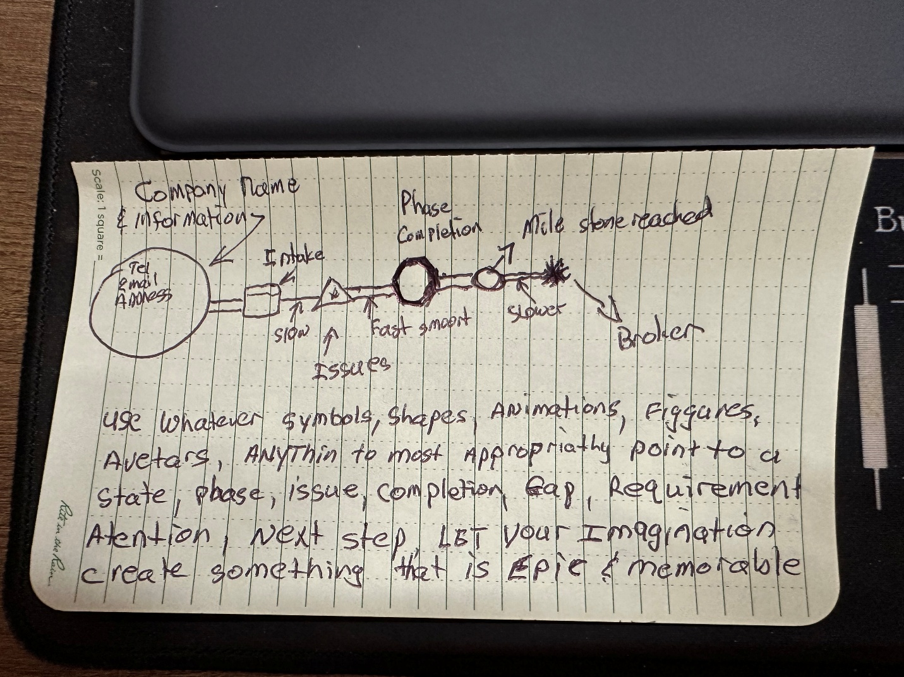

# VIO MUST BE CONNECTED — Cursor-Ready Source Brief

> **Status:** Canonical design source for VIO. Binding.
>
> This document is Carl Visagie's authoritative brief, enshrined verbatim
> into the repo so it can never be lost. Any future work on VIO MUST be
> reconciled against this brief and against the authoritative sketch
> at [`assets/vio_sketch.jpeg`](./assets/vio_sketch.jpeg).
>
> Companion docs:
>   - [`VIO_CONSTITUTION.md`](./VIO_CONSTITUTION.md) — binding design law
>   - [`VIO_DOCTRINE.md`](./VIO_DOCTRINE.md) — visual-language charter
>
> Provenance: extracted from `VIO_Cursor_Brief_Package.zip` provided
> 2026-06-04 by Carl after the production VIO surface was found to be
> the *wholly inadequate* prototype this brief calls out.

---

## 1. Direct Ask

- VIO is going to be the only primary operator interface.
- No separate Control, Command, Status, Inbox, Intelligence, Onboarding,
  or Operational pages as the primary workflow.
- Current VIO is not working as intended.
- The handwritten sketch is the design target. The screenshots show
  what VIO must replace.

## 2. Production Reality Rule

- Production only.
- No seed data, mock data, local counts, preview counts, or demo-only truth.
- If something exists in VIO, it must exist in production durable storage
  and production organism state.

## 3. Core VIO Model

- **The company itself is the interface object.**
- Each company is a living spine/timeline from upload/intake to completed/
  shipped deliverable.
- Every phase, document, issue, action, payment, blocker, recommendation,
  and completion state attaches to the spine.
- If a sub-story is too complex for a simple mark, it becomes a **branch**
  from the spine at the exact time/phase it happened.
- Branches are visual sub-timelines, not tabs.
- **Problems must be visible before the operator looks for them.**
- Text is drill-down only; shape, position, color, motion, and branching
  carry first-level meaning.

## 4. What VIO Replaces

VIO is the destination for ALL of these surfaces. Each must be either
absorbed into a VIO node/branch/glyph or deliberately killed:

- Control / Operator Cockpit
- Upload pipeline
- Evidence Integrity
- Intake Queue
- Payment / PayPal actions
- Operational Command
- Operational Intelligence
- Onboarding Intelligence
- Acquisition Intelligence / Reddit Approval
- Operational Alerts
- Compliance Intelligence Watch
- Project Command Strip
- Knowledge / Advice
- Organism Health
- Engine Integration

## 5. Required Visual Grammar

- **Company identity orb:** company name, contact, email, identifiers
  at the start of the spine.
- **Main spine:** company journey from intake/upload to completed
  deliverable.
- **Shapes:**
    - **□ square** = intake / document
    - **▲ triangle** = issue
    - **○ circle** = phase
    - **◇ diamond** = decision
    - **✱ starburst** = blocker
- **Color:**
    - **green** = healthy / complete
    - **amber** = attention
    - **red** = blocked / failing
    - **blue** = information
    - **grey** = inactive / not started
- **Motion:** pulse / glow / animation indicates activity, urgency,
  waiting, or heartbeat.
- **Branch:** complex sub-story grows from the node/time where it
  happened and expands into its own mini-timeline.

## 6. Implementation Acceptance Criteria

- A production-uploaded company appears in VIO without opening Control.
- VIO shows uploaded paperwork, OCR/evidence status, gaps, missing
  documents, payment status, project/kickoff state, and next action.
- VIO can process the first customer lifecycle without Control as the
  primary interface.
- If Control is required for an action, log that as a VIO gap.
- VIO shows organism health, storage durability, scheduler heartbeat,
  payment aging, review queue items, and integrity proof status.
- **If the organism knows it, VIO must show it or make it discoverable
  from the correct visual node/branch.**

## 7. Cursor Task (verbatim from Carl)

```text
TASK: Rebuild VIO toward the source-document vision, not toward another
dashboard.

Do not add more tabs as the solution.
Do not make VIO depend on Control for primary operator awareness.

Use existing production APIs where possible. Add missing production
endpoints only where VIO cannot tell the complete story without them.

First target: one production-uploaded company can be understood and
advanced from VIO alone.

Final direction: VIO replaces Control, Command, Status, Inbox,
Intelligence, Onboarding, Alerts, and Organism Health as primary
operator surfaces.
```

## 8. Authoritative Sketch

This is the design target. Re-read it before every VIO change.



> "Use whatever symbols, shapes, animations, figures, avatars, anything
> to most appropriately point to a state, phase, issue, completion, gap,
> requirement, attention, next step. Let your imagination create
> something that is epic & memorable."

Reading the sketch:

- **Big circle, far left:** company identity orb. Holds company name,
  tel, email, address. This IS the start of the spine — not a sidebar.
- **□ square** (right of the orb): "Intake" — the first document arrived.
- **⬢ thick hexagon:** "Phase Completion" — a major milestone closed.
- **○ medium circle:** "Mile stone reached" — a discrete milestone marker.
- **○ small circle + arrow:** "Slower" — pacing degraded around this event.
- **✱ starburst (far right):** "Broken" — the spine breaks at this point.
- **▲ triangles below the spine:** pace markers — "slow", "fast smooth",
  "slower". Speed-of-progression cues separate from event shapes.
- **▲ triangle above the spine:** "Issues" — an issue raised at this point.

Everything hangs on a continuous horizontal spine at the temporal
position it happened. The spine is a **timeline**, not a fixed
stage-bar.

## 9. The Inadequate Prototype (what we are NOT building)

This is the rejected attempt — too close to dashboard/card thinking,
does not embody the sketch:


The unified-line view shipped to production prior to 2026-06-04 was
this prototype's lineage. The replacement built against this brief
must use the sketch grammar (event shapes at temporal positions on
a continuous spine), not the prototype grammar (fixed stage bars with
generic circles and side-panel status pills).

---

## 10. Reconciliation Notes (post-brief commitments)

These are decisions made after reading this brief; they bind future work.

- **2026-06-04 — Boundary clarified.** Organism-state surfaces
  (telemetry, learning, acquisition pipeline, observability, scheduler
  heartbeat, payment aging) are NOT separate pages with their own URLs.
  They live INSIDE VIO as visual subsystem glyphs/orbs. The Intake/Upload
  glyph is the door into the company-spine universe. Organism glyphs
  surface their organ's state without taking the operator out of VIO.
  Supersedes any prior wording that said "organism orbs live outside
  VIO."

- **2026-06-04 — The 14 surfaces in §4 are a kill-list, not a co-exist
  list.** Migration order is: prove the capability inside VIO → delete
  the old surface in the same commit. See `VIO_ABSORPTION_INVENTORY.md`
  (to be built).
